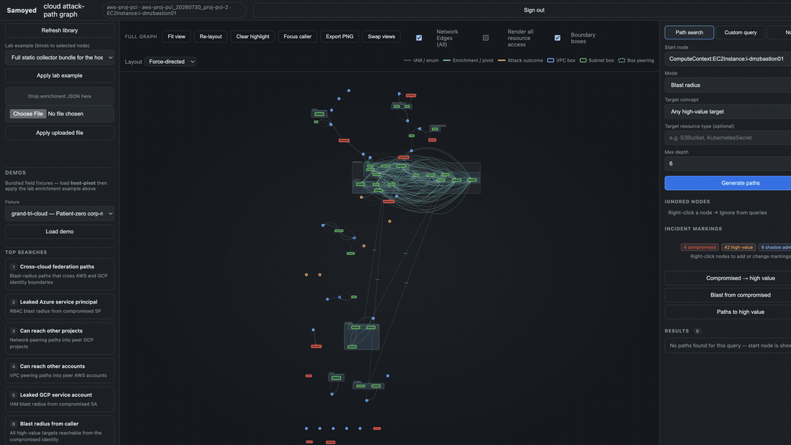
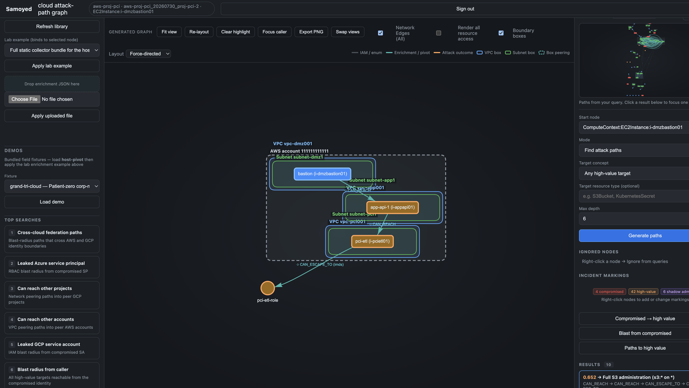
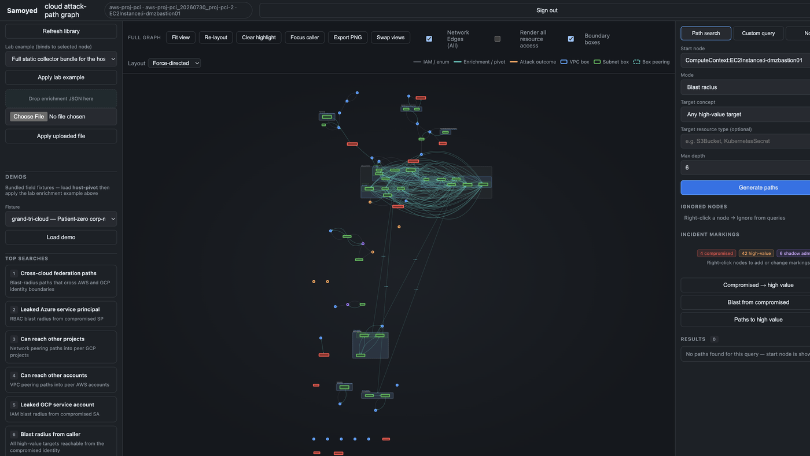
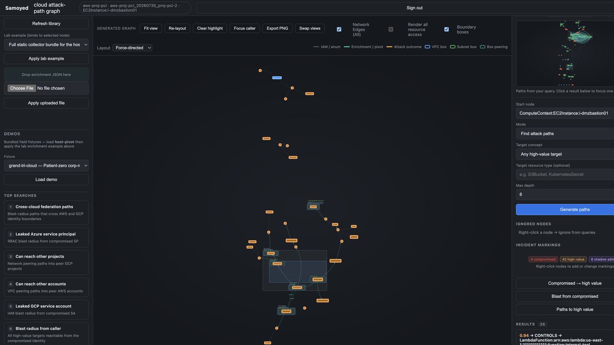

# Samoyed

**BloodHound for cloud.**

Samoyed turns cloud identity, trust, and network reachability into an attack-path graph — then answers the question that matters after a leak, a pod escape, or a WIF pivot: *what can this compromise actually reach?*

Multi-cloud by design. AWS, GCP, Azure, and Kubernetes map into one ontology. Paths carry evidence. Agents and analysts query the same graph.



<p align="center"><em>grand-tri-cloud lab — 211 nodes across AWS / GCP / Azure. Bastion patient-zero → app tier → PCI ETL role → Full S3 admin.</em></p>

```bash
pip install -e ".[dev,mcp]"
samoyed import-fixture grand-tri-cloud
samoyed scenario intercloud-federation
export SAMOYED_PASSWORD='dev'
samoyed ui   # http://127.0.0.1:8000
```

---

## What it does

| Capability | Why it matters |
|---|---|
| **Attack-path search** | Blast radius from a leaked key, compromised SA, host theft, or supply-chain write — not just asset inventory |
| **Shared ontology** | Identities, entitlements, trust, runtimes, workloads, secrets, and data across providers — extensible via plugins |
| **Live enum + offline ingest** | Profiles / ADC / `az login`, or import iam-report, Terraform state, CloudFox, BloodHound CE, Cartography |
| **Network without noise** | VPC peering and SG-lite reachability as `CAN_REACH` / `VPC_PEERS` / `BRIDGES_TO` — no VPC/SG node soup |
| **Inter-cloud pivots** | WIF / OIDC / synced identities auto-graft peer sessions; `intercloud-map` surfaces the bridges |
| **API probing** | When IAM list is denied, probe high-value APIs and promote successes into the graph |
| **Agent-native** | MCP server for Cursor/Claude — mark compromise, find paths, run scenarios from chat |
| **Interactive UI** | Force-directed graph, path highlight, markings, session browser |

---

## Install

```bash
python -m venv .venv && source .venv/bin/activate
pip install -e ".[dev,mcp]"
# Optional cloud extras:
# pip install -e ".[gcp]" / ".[azure]" / ".[k8s]"
pre-commit install
docker compose up -d   # optional Neo4j persistence
```

Requires Python 3.9+.

---

## Sixty-second demo

No cloud account. Bundled field-shaped reports:

```bash
samoyed import-fixture grand-tri-cloud
samoyed scenario intercloud-federation
samoyed ui

# Smaller starters
samoyed import-fixture lab-aws
samoyed scenario leaked-credential
samoyed import-fixture enterprise-aws      # marketing EC2 → CI/CD → EKS → vault
samoyed import-fixture --list
```



Bastion in the DMZ can reach `app-api-1`, then PCI ETL, then escape via IMDS into `pci-etl-role` — scored path to full S3 administration.

<details>
<summary>Full mesh + blast radius stills</summary>





</details>

---

## Live enumeration

Provider is auto-detected from credentials when you omit `--provider`.

```bash
# AWS
samoyed enum --profile attacker
samoyed whoami --profile attacker

# GCP (ADC / GOOGLE_APPLICATION_CREDENTIALS / SA JSON)
pip install 'samoyed[gcp]'
samoyed enum
samoyed whoami

# Azure (AZURE_SUBSCRIPTION_ID + az login / SP)
pip install 'samoyed[azure]'
samoyed enum
samoyed whoami

# Kubernetes
pip install 'samoyed[k8s]'
samoyed enum --provider kubernetes
```

### Low-priv / leaked keys

When the key cannot list IAM/RBAC, probe what it can actually call:

```bash
samoyed probe --key-file leaked.json
samoyed enum --with-probe --key-file leaked.json
samoyed probe --list
```

Custom operations live in `.samoyed/probes.json`.

### Emulated AWS lab

Vulnerable topology is seeded into LocalStack — nothing sensitive in the repo:

```bash
samoyed firing-range up && samoyed firing-range seed && samoyed firing-range enum
```

See [firing-range/README.md](firing-range/README.md).

---

## Scenarios

| Scenario | Start condition |
|---|---|
| `leaked-credential` | Compromised IAM / cloud principal |
| `compromised-sa` / `pod-escape` | K8s service account or container escape |
| `host-compromise` | Laptop / workstation with cached cloud creds |
| `can-reach-other-accounts` | VPC peering / network graft into peer scopes |
| `intercloud-federation` | WIF / OIDC / foreign assume-role bridges |

```bash
samoyed scenario leaked-credential --session-id <id>
samoyed scenario intercloud-federation --session-id <id>
samoyed intercloud-map --session-id <id>
```

Start aliases: `caller`, `host`, `compromised`. Target alias: `target_concept=high_value`.

---

## Ingest anything you already have

```bash
# Terraform / network inventory (offline)
samoyed import-path ./infra/terraform.tfstate
samoyed import-path ./network.json --attach-to <session>

# Cartography Neo4j → Samoyed attack session
export CARTOGRAPHY_NEO4J_URI=bolt://localhost:7687
samoyed cartography-status
samoyed import-cartography \
  --caller-arn arn:aws:iam::123456789012:user/alice \
  --account-id 123456789012

# BloodHound CE / AzureHound / SharpHound
samoyed import-bloodhound ./azurehound.json

# Goat labs (clone into gitignored .samoyed/)
git clone https://github.com/ine-labs/GCPGoat.git .samoyed/GCPGoat
samoyed import-path .samoyed/GCPGoat

git clone https://github.com/ine-labs/AzureGoat.git .samoyed/AzureGoat
samoyed import-path .samoyed/AzureGoat
```

Useful fixtures: `lab-gcp`, `lab-azure`, `corp-mesh-aws`, `corp-mesh-gcp`, `corp-mesh-azure`, `wif-aws-gcp`, `wif-aws-azure`, `wif-gcp-azure`, `bloodhound-entra-lab`, `hybrid-mimikatz-entra`, `cicd-supply-chain`, `vpc-peering-aws`.

`import-path` on a directory merges all `*.tfstate` and auto-applies companion `enrichment.json` files (used by `grand-tri-cloud`).

---

## Web UI

```bash
export SAMOYED_PASSWORD='choose-a-strong-password'
samoyed ui
# http://127.0.0.1:8000 — login at /login
```

Protects `/` and `/api/*` (except health + auth). Programmatic clients can send `Authorization: Bearer $SAMOYED_API_TOKEN`. Binding beyond localhost without credentials auto-generates a password and prints it to stderr.

OpenAPI: `/openapi.json`.

---

## MCP (Cursor / Claude)

```json
{
  "mcpServers": {
    "samoyed": {
      "command": "samoyed",
      "args": ["mcp"]
    }
  }
}
```

Tools include `list_sessions`, `mark_nodes`, `mark_from_alert`, `find_attack_paths`, `get_blast_radius`, `run_scenario`, `describe_intercloud_paths`, and ontology resource `samoyed://ontology`.

```text
mark_nodes('["arn:aws:iam::123:user/jane"]', compromised=true)
mark_nodes('["prod-db", "corp-vault"]', high_value=true)
find_attack_paths(start="compromised", target_concept="high_value")
```

---

## Environment

| Variable | Purpose |
|---|---|
| `NEO4J_URI` / `USER` / `PASSWORD` | Optional graph persistence (`samoyed-dev` default password) |
| `CARTOGRAPHY_NEO4J_*` | Cartography sync DB (falls back to `NEO4J_*`) |
| `SAMOYED_USERNAME` / `SAMOYED_PASSWORD` | Web UI auth (`admin` default user) |
| `SAMOYED_API_TOKEN` | Bearer token for API clients |
| `SAMOYED_SECRET_KEY` | Session signing (set in production) |
| `SAMOYED_HOME` | Data root (default `~/.samoyed`) |

---

## Development

```bash
pytest
ruff check samoyed tests
```

Extend Samoyed by emitting `ConceptArtifact` objects — never write the graph directly. Scaffold plugins with:

```bash
samoyed init-extension enumerator my_internal_api
samoyed init-extension connector my_graph_source
```

Full extension cookbook, network model, and L1 concept table: **[AGENTS.md](AGENTS.md)**.
